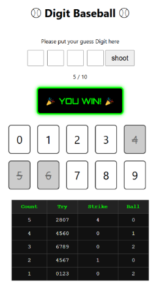
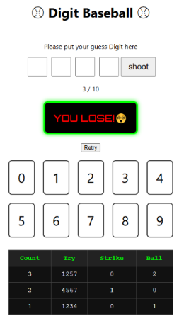

# ⚾ Digit Baseball ⚾  

숫자 추리 게임 "Baseball Guess"는 숫자를 입력해 Strike와 Ball 힌트를 바탕으로 정답을 추리해 나가는 미니 게임입니다.  
숫자 위치와 값을 맞추면 Strike, 값만 맞추면 Ball!  
10번 안에 4 스트라이크를 맞히면 YOU WIN!

# 📌 주요 기능
🎮 게임 시작 및 리셋  
게임 시작 버튼을 누르면 무작위 4자리 숫자가 생성되어 게임이 시작됩니다.  
시도 횟수가 10회를 넘기면 게임 오버!

🧠 숫자 카드 선택  
0~9까지의 숫자 카드 클릭으로 입력이 가능하며,  
1회 클릭: 확정 숫자로 표시  
2회 클릭: 카드 비활성화  
3회 클릭: 초기 상태로 돌아감  

✍️ 입력과 힌트  
선택된 숫자를 입력창에 입력할 수 있고, 제출 후 힌트(Strike, Ball)가 표시됩니다.

📊 히스토리 기록  
지금까지의 추측 결과가 Strike / Ball 테이블 형식으로 정리되어 표시됩니다.

🎆 승리/패배 UI 효과  
게임 결과에 따라 멋진 메시지와 함께 다시 시작할 수 있는 RETRY 버튼 제공.

# 🖥️ 기술 스택
React – 컴포넌트 기반 UI  
JavaScript – 로직 처리  
CSS – UI 스타일링  
Git/GitHub – 버전 관리  

# 🧪 실행 방법

1. 프로젝트 클론  
git clone https://github.com/yourusername/baseball-guess-game.git  
cd baseball-guess-game  

2. 패키지 설치
npm install

3. 개발 서버 실행
npm start

# 👤 개발자 정보
개발자: jhcodeDev  
GitHub: https://github.com/jhcodeDev  